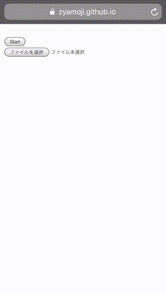
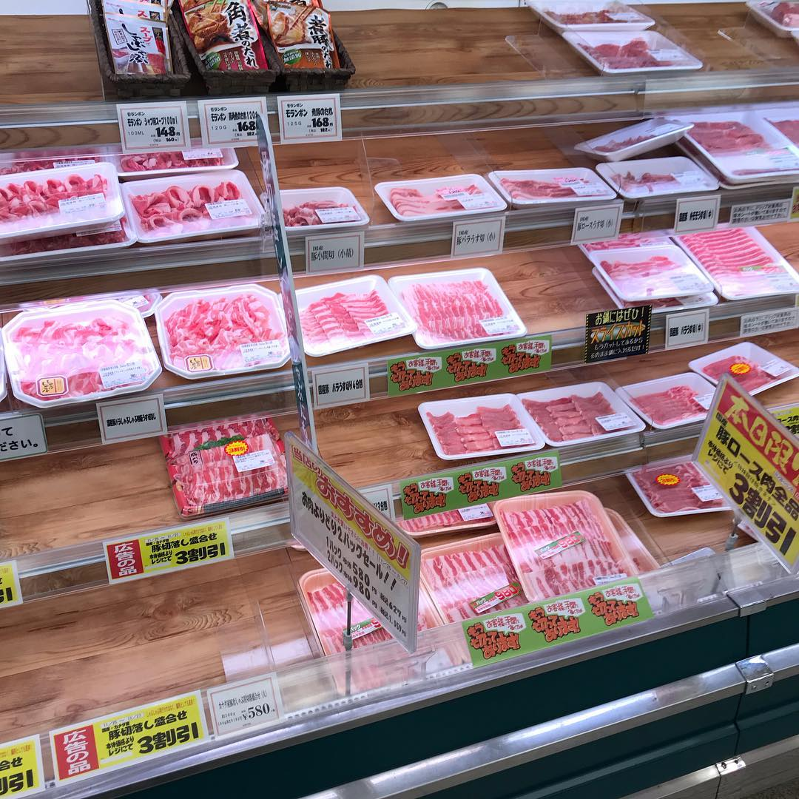
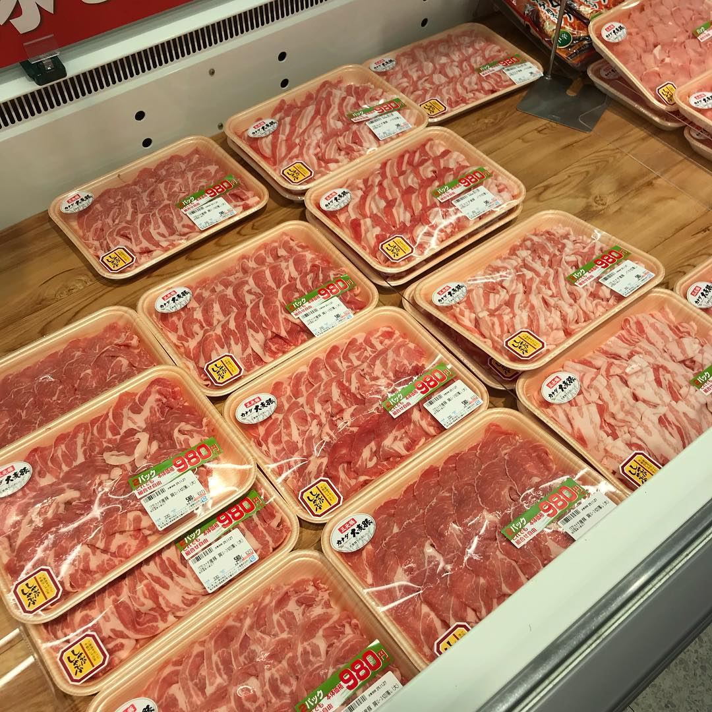

Convert to meat photo.
----

Not Grayscale, but Meatscale

[Test page](https://zyamoji.github.io/meat_scale/)

This app convert your photo into meat-like-photo.

Demo  

1. Tap Start button.
2. Tap Shot button or video.
3. Tap Meat button.
4. Save meatscale image.

You can use Browse button instead of live video.

I wish converted photo looks like this.

or 

Mobile Android, iOS Safari ready.
